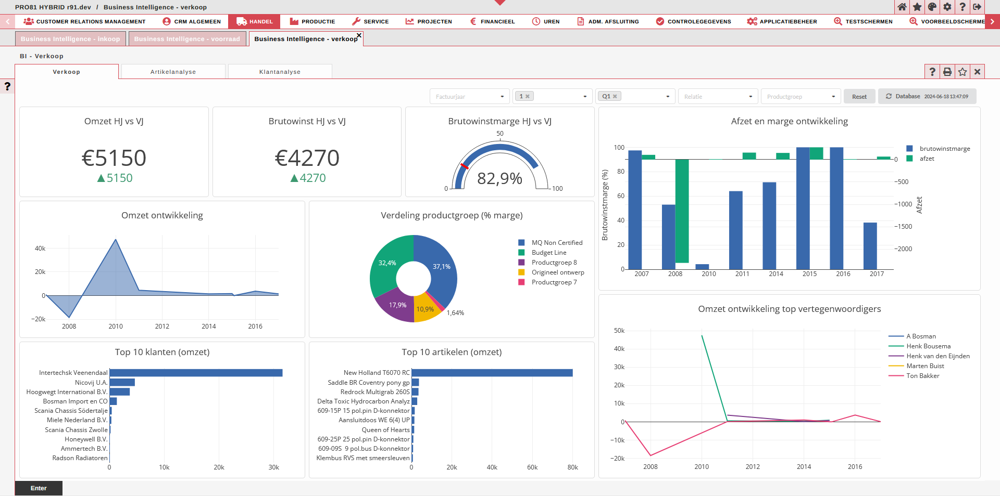

# Pantheon Business Intelligence

### Overview

Pantheon Business Intelligence was developed as an alternative, 'in house', Oculus solution to Qlik Sense. 
The aim was to provide an affordable business intelligence solution to Pantheon Oculus clients, integrating dynamic screens, filters, graphs
and tables to be used by company data analysts.

### Structure

- Modular React front end.
- IDL and layout conversion to react components.
- PHP and R backend using a data warehouse.
- Integrated into Oculus client via iframe.

As with most Pantheon development, unit tests are written in Jest and components using Storybook. 

### Contributions

- React application development.
- IDL and layout translation.
- Oculus integration.
- Symfony middleware integration.