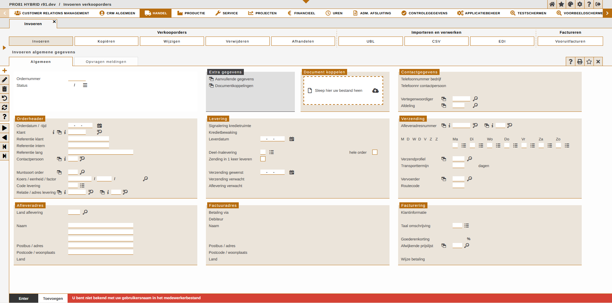
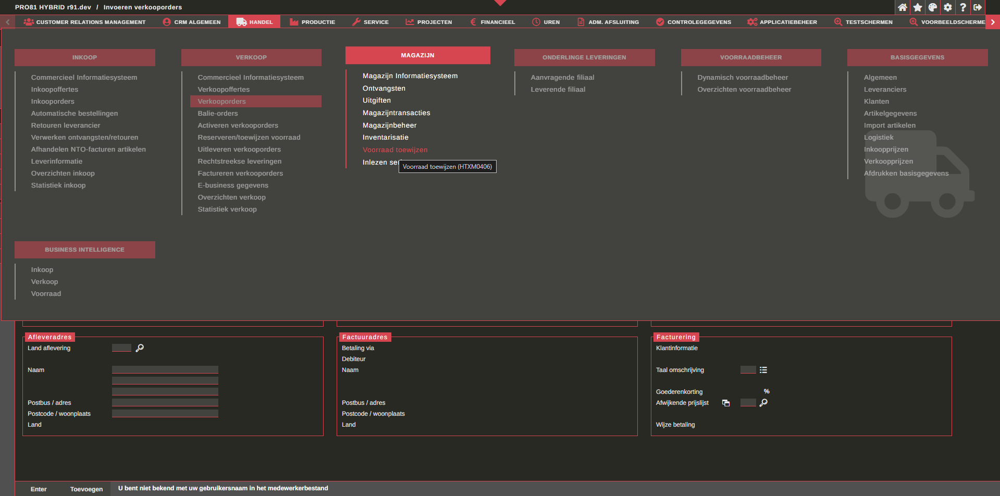
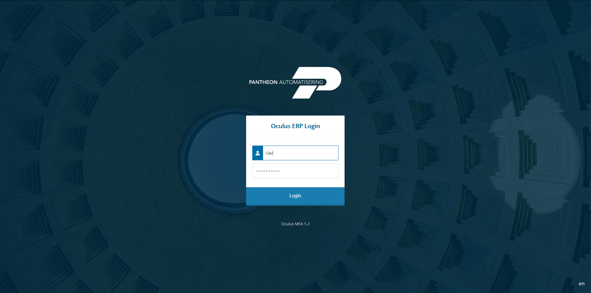
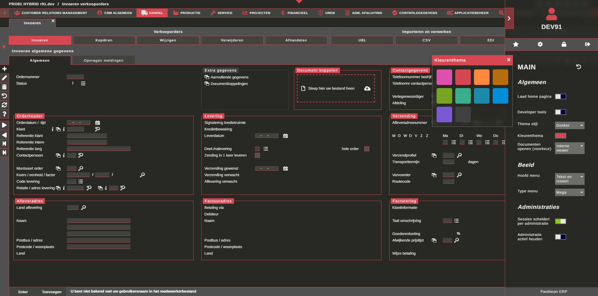

# Oculus

## Overview

Oculus is the primary ERP (Enterprise Resource Planning) application offered by Pantheon Automatisering. It serves as the main business 
management tool for several companies, supporting hundreds of users daily.

The client-side application is developed using a mixture of React, TypeScript, and JavaScript, and is styled with SCSS. It features a 
configurable user interface capable of rendering tens of thousands of unique custom view definitions and workflows, translated from IDL (Interface 
Definition Language). While the interface is currently modularised using iframes, it is in the process of being refactored to a fully 
React-based architecture.

Oculus follows a loosely defined MVC (Model-View-Controller) design pattern. The middleware layer is a hybrid API composed of Symfony and 
legacy net.data, organised into microservices. Business logic is processed and stored using RPG on IBM-i servers, with data being managed 
in a DB2 database.

The software also acts as a low-code interface framework for several customers implementing their own business solutions.

All new developments adhere to clean code principles, ensuring maintainability, scalability, and reliability of the codebase.

## My Role

### Ongoing Maintenance

Over the past five years, a significant portion of my role involved the ongoing maintenance of the Oculus ERP software. 
This entailed addressing bugs, implementing small features, and performing refactors to improve the software's functionality 
and performance.

**Bug Management and Task Allocation:**

Bugs were reported and managed as tasks in Jira, following a scrum methodology. These tasks were assigned to developers, including 
myself, during scrum-style sprints. Each sprint culminated in minor releases, which underwent rigorous testing and quality control 
to ensure stability and reliability.

**Contributions:**

- Responsible for diagnosing and resolving a wide range of bugs across the codebase, from vanilla JavaScript to complex CSS issues.
- Utilised debugging tools and techniques to identify the root cause of problems and implement effective solutions.
- Delivered small features and incremental refactors through a growing web component library.
- Contributed to codebase improvements by refactoring legacy code to enhance readability, maintainability, and performance.
- Conducted thorough testing of bug fixes and new features to ensure they met quality standards.
- Worked closely with the QA team to address any issues identified during testing phases.
- Ensured that all maintenance releases were stable and met the high standards expected by end-users.
- Consistently delivered high-quality maintenance releases that improved the overall stability and user experience of the Oculus software.
- Contributed to the reduction of technical debt through systematic bug fixing and code refactoring.

**Collaboration:**

Worked as one of two developers focused on maintenance of the frontend client, fostering a collaborative environment where knowledge sharing and mutual support were key to our success.

### Client Refactor (incremental refactoring and micro-frontends)

Oculus is a monolithic ERP software built 16 years ago, encompassing a vast amount of legacy technical debt, 
including outdated JavaScript, HTML, and CSS. The original system was structured using tiered iframes, extensive vanilla 
JavaScript, and CSS. The goal of this project was to modernise the Pantheon client software by aligning it with 
contemporary technologies and reducing the overall codebase. This undertaking required a complete re-write of the DOM structure.

**Project Objectives:**

- Modernise the client-side application to enhance maintainability and scalability.
- Reduce technical debt by refactoring and updating legacy code.
- Ensure seamless integration of new technologies with the existing system.

**Technological Transition:**

In 2024, we initiated the process of refactoring the main client into React, systematically addressing each iframe component in 
turn (incremental refactoring). The legacy code managed state through data providers attached directly to 
HTML elements. To facilitate the transition to React, Valtio was chosen as the state management library to mediate between vanilla 
JavaScript and the newly introduced React components. This choice was critical to maintaining continuous integration and ensuring 
the system remained functional throughout the refactor.

**Contributions:**

- Analysed the existing DOM structure and identified areas for improvement.
- Redesigned the DOM to simplify styling (SCSS modules) and be more compatible with React.
- Developed a strategy for refactoring iframe elements.
- Integrated Valtio for smooth state management and transitions between legacy and React.
- Implemented unit tests (Jest) and Storybook to test new components.
- Optimised the performance of React components to ensure a more responsive user experience.

This project was ongoing when I left Pantheon, but we had successfully replaced the first iframe (including login and state retrieval).

### PHP middleware

**Project Overview:**

In 2020, we embarked on a critical refactoring project to modernise our middleware layer due to the deprecation of net.data. 
Given the limited support for Node.js on IBM-i systems, we opted to use PHP to develop a heavily modified Symfony controller. 
This new middleware architecture was designed to serve smaller microservices via API to the client. The project involved 
systematically replacing old net.data services with new PHP-based services, leveraging an XML toolkit to manage stateful requests 
to the IBM-i server and business logic. I was one of three developers dedicated to this project.

**Project Objectives:**

- Modernise the middleware to ensure compatibility with current technologies and frameworks.
- Replace deprecated net.data services with robust and scalable PHP services.
- Maintain seamless integration with the IBM-i server and its business logic.

**Technological Transition:**

Due to the constraints of limited Node.js support on IBM-i, PHP was selected as the middleware language. We utilised the Symfony 
framework to build a flexible and maintainable controller that could efficiently handle the required microservices. The XML toolkit 
was employed to facilitate stateful communication between the new PHP services and the IBM-i server (reconnecting to jobs), ensuring
continuity of business operations.

**Contributions:**

- Middleware design and development.
- Architected a modern middleware layer using PHP and Symfony.
- Designed and implemented microservices to replace legacy net.data services.
- Integrated the XML toolkit to manage stateful requests between PHP services and the IBM-i server.
- Collaborated closely with two other developers, ensuring cohesive progress and knowledge sharing.
- Conducted code reviews and provided mentorship to junior team members.
- Implemented comprehensive unit (PHPUnit) tests to ensure the reliability of the new services.

### Multi-factor authentication

The implementation of multi-factor authentication (MFA) was a critical project designed to enhance the security of the Oculus ERP 
software. This project involved creating React-based landing pages and integrating them with a Symfony login middleware. 
The MFA system ensured that user authentication was secure and reliable by leveraging Google Authenticator and session cookies.

**Structure:**

- React Application: Developed a standalone React application that served as the landing page for user authentication. This application included an encapsulated web component version of the Oculus client loader.
- Symfony Middleware: Designed and built a Symfony controller that managed the authentication process, consolidating Google Authenticator responses using OTPHP and handling session cookies.
- DB2 Database Connections: Managed connections to the DB2 database using the XML toolkit, interfacing with RPG business logic to ensure data integrity and security.

**Contributions:**

- React application design and development.
- Symfony middleware integration.
- Toolkit connections to business logic.

**Roles and Responsibilities:**

- Took primary responsibility for designing and building the React application and its connection to the Symfony middleware.
- Collaborated with team members to integrate the new authentication system with the existing Oculus infrastructure.

### CSS Refactoring and Theming

Upon joining the team in 2019, I identified a significant need to modernise and modularise the styling of the Oculus ERP software. 
Initially, the application’s styling consisted of tens of thousands of lines of unstructured CSS. I initiated the process of 
breaking down these monolithic stylesheets into manageable modules using SCSS, enabling more efficient and maintainable code.

**Implementation:**

- SCSS Variables and Mixins: Defined a comprehensive set of SCSS variables for colors, fonts, and spacing, along with mixins for reusable styles.
- Modularisation: Refactored the extensive block of CSS into SCSS modules and templates, creating a more organised and maintainable codebase.
- Efficiency: Improved the efficiency of the styling process by leveraging SCSS features such as nesting, inheritance, and partials.
- Dark and Light Theme: Implemented a global dark and light theme by leveraging SCSS variables and conditional logic to switch styles based on the selected theme.
- Scalability: Created a scalable theming system that can easily accommodate new themes and design changes.
- Custom Client Themes: Designed and implemented custom client themes using SCSS templates and logic patterns, ensuring each client could have a unique look and feel that matched their branding.

**Role and Responsibilities:**

- Led the refactoring of the CSS into a modular SCSS architecture. 
- Designed and implemented the custom theming system, including the global dark and light themes.
- Collaborated with the development team to integrate the new theming system into the existing application.