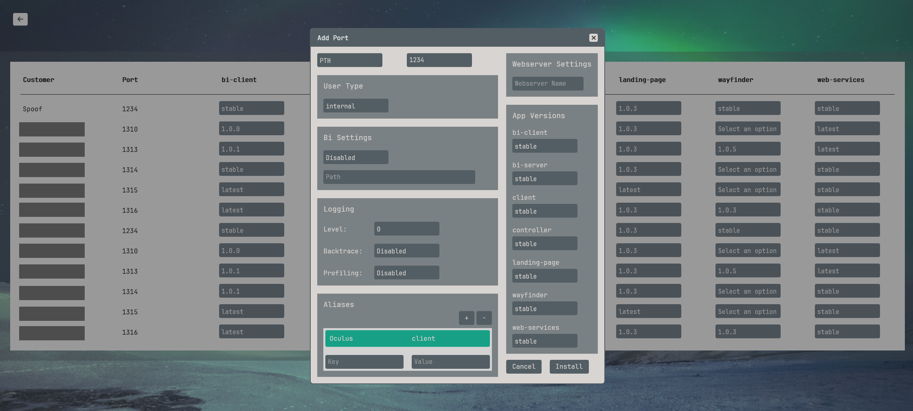
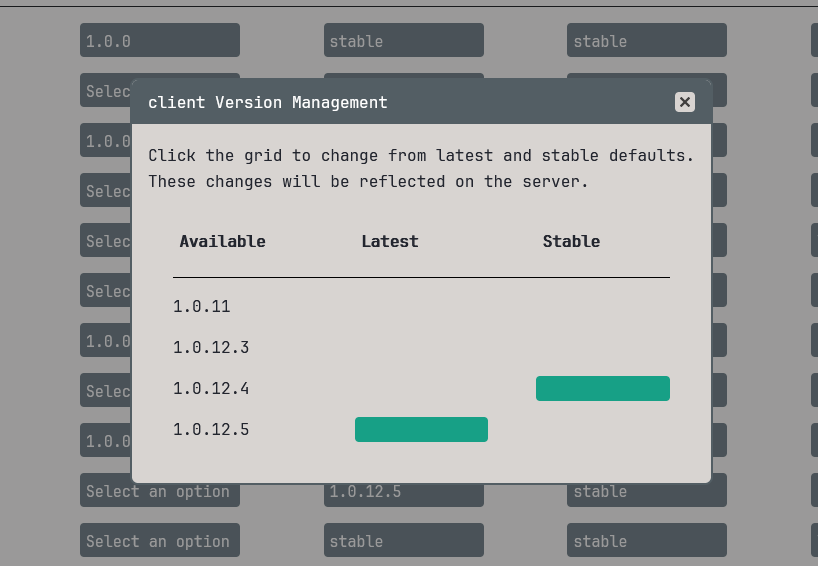

# Pantheon Tooling and Installers

### Overview

During my time at Pantheon, I contributed to the development of several in-house tools. These projects included proxies, build tools, installers, and Docker/development environment instances. The tools were built using a variety of programming languages such as Node.js (TypeScript), PHP, and C#.

One of the more interesting projects I worked on was the Oculus installer.

### Structure

The Oculus installer was a standalone application developed in C#. It utilized WebView2, a local REST API, and a bundled React application. This setup allowed the installer to connect a desktop to a server over SSH, facilitating the installation and upgrade of Oculus-based products.

### Contributions

I collaborated on this project with one other developer. My responsibilities included building the React front end, implementing WebView2, and defining the routes for the local REST API. My colleague, who had more experience with IBM i systems, focused on the server integration. This collaborative effort ensured a seamless and efficient installation process for our users.