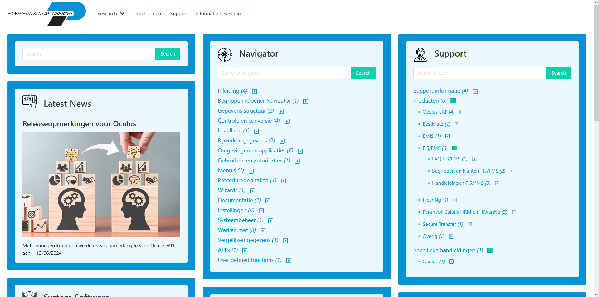
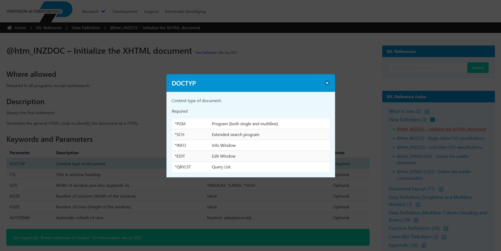
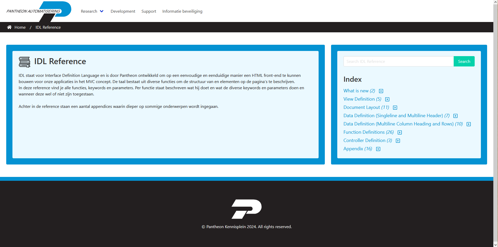
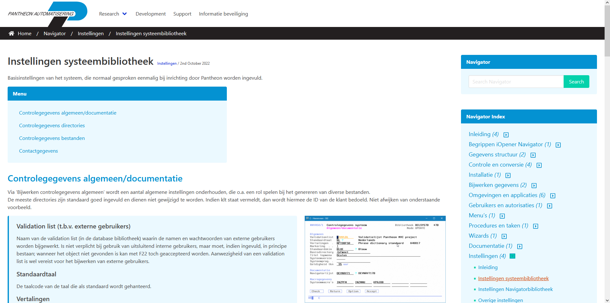

# Pantheon Wiki

### Overview

The Pantheon Wiki is a WordPress site serving as a 'user guide' for Pantheon products and technical teams. The internal site was first launched in 2020 and is updated and used by Pantheon employees and clients on a daily basis.

### Structure

The site consists of a completely bespoke theme utilising the Advanced Custom Fields PRO plugin for additional meta management.
Blocks and layouts are created using a custom created plugin and the Gutenberg block editor.

Custom post types are used to create unique pages and references between shared fields such as Oculus IDL references.

The site is split into unique categories so that each team in Pantheon can share technical knowledge.

### Contributions

During my time at Pantheon I designed, built and managed the Wiki.